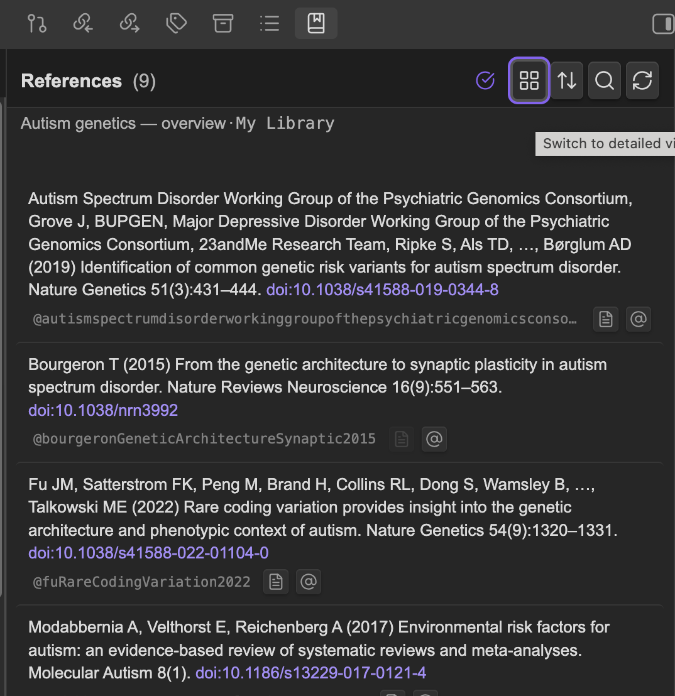
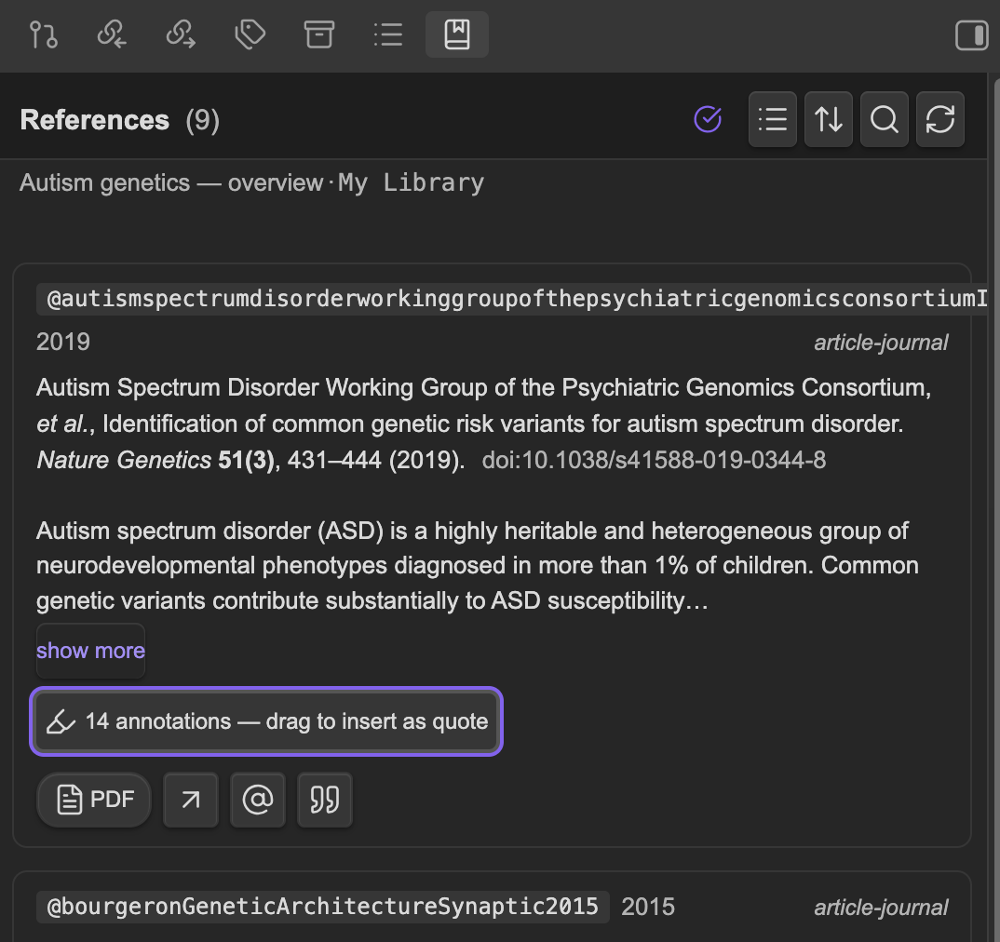
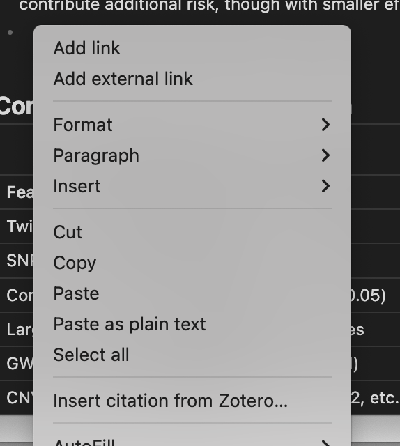

# zoob

Zotero bibliography inside Obsidian — a rich references side panel, hover previews on `[@citekey]`, and live CSL-formatted reference blocks. Talks to Zotero via [Better BibTeX](https://retorque.re/zotero-better-bibtex/).

Modeled on [obsidian-deepsit](https://github.com/bassio/obsidian-deepsit) — same conventions (Pandoc `[@citekey]`, `bib:` frontmatter, BBT citekeys) with a much richer panel and citation↔item linking.

## Requirements

- Obsidian 1.5+ (desktop only)
- Zotero 7+ (works with 7, 8, 9) running
- [Better BibTeX](https://retorque.re/zotero-better-bibtex/installation/) installed in Zotero

## Installation

zoob isn't in Obsidian's Community Plugins catalog yet — submission is on the to-do list. Until then, install one of these two ways.

### Manual install (from a release)

1. Grab the three files from the [latest release](https://github.com/ppavlidis/zoob/releases/latest): `main.js`, `manifest.json`, `styles.css`.
2. Create the folder `<your-vault>/.obsidian/plugins/zoob/` and drop the three files in.
3. In Obsidian, **Settings → Community plugins**, turn off Restricted mode if it's on, then enable **zoob** in the *Installed plugins* list. (You may need to hit the refresh icon next to *Installed plugins* once.)

### BRAT (auto-updating)

If you have the [BRAT](https://github.com/TfTHacker/obsidian42-brat) plugin (Beta Reviewers Auto-update Tool):

1. *BRAT → Add Beta plugin* → paste `ppavlidis/zoob` → Add.
2. Enable **zoob** in *Community plugins*.

BRAT will pull updates whenever a new GitHub release is cut.

### Build from source

```bash
git clone https://github.com/ppavlidis/zoob.git
cd zoob
npm install
npm run build           # typecheck + production bundle
```

Then copy `main.js`, `manifest.json`, and `styles.css` into `<vault>/.obsidian/plugins/zoob/` and enable the plugin. See [Build & install](#build--install) below for the watch-mode workflow and auto-deploy.

## Getting started

Open the references panel by clicking the  **zoob: references** icon in Obsidian's left ribbon. 

Add `bib:` to a note's frontmatter to scope suggestions and panel resolution to a Zotero collection (nested paths supported):

```yaml
---
bib: "My Library/AI Safety/Papers"
---
```

Cite with Pandoc syntax anywhere in the note:

```markdown
Smith et al. showed X [@smith2024transformer].
Multi-cite also works: [@a2020; @b2021, pp. 12–14].
```

Render a bibliography with a fenced Pandoc div:

```markdown
::: {#refs}
:::
```

## Features

### References panel

The right-sidebar panel lists every item cited in the active note. Two density modes, toggleable from the panel header:

| Compact rows (default) | Detailed cards |
| :---: | :---: |
|  |  |

Header controls (left → right):

- **Density toggle** — compact one-line rows (default) vs. detailed rich cards.
- **Sort toggle** — document (cite-order) vs. alphabetical by first author. Highlighted when A–Z is active so you can tell at a glance.
- **Filter** — opens a substring search box; space-separated terms are AND-combined across citekey, title, authors, year, and tags. Esc clears or collapses.
- **Refresh** — forces a re-fetch from Zotero.
- A connection dot (green check / red triangle) that reflects live Better BibTeX health.

Each detailed card shows title, authors, year, venue, tags, a collapsible abstract, DOI/URL, attachment badges (PDF, snapshot, link), annotation count, and one-click actions (open in Zotero, insert citation, copy formatted entry). If a Zotero child note starts with "AI summary", its text appears prominently on the card. If you've opted in to Semantic Scholar lookups (see *Citation counts* below), the hover card also shows a "Cited by N" badge.

Drag any annotation from the panel onto the editor to paste it as a Markdown blockquote with an inline citation; click instead for cursor-position insertion.

### Citation counts

**Off by default.** Turn on *Show Semantic Scholar citation counts* in settings to have hover cards show a `Cited by N` badge.

The badge is backed by [Semantic Scholar's](https://api.semanticscholar.org/) free graph API — unauthenticated, shared ~100 req / 5 min pool, so don't abuse it. When the feature is on:

- Each paper is looked up once by DOI (preferred) or title. Hits and misses are cached on disk in `s2-cache.json` under the plugin folder, so the cache survives Obsidian restarts.
- The **refresh interval** is configurable via a slider in settings (default **30 days**). Slide it all the way to the left for "**never refresh after first check**" — the friendliest setting for S2's shared endpoint.
- When a note with many references opens at once, some requests may get rate-limited and come back as `Cited by: ?`. That `?` badge is **click-to-retry** — clicking invalidates the cached miss for that paper and re-fires the lookup. This works at any TTL setting, including "never".
- A `?` with no cursor change on hover means the item has no DOI or title for S2 to search with; there's nothing to retry.

### Hover previews


Hover a `[@citekey]` in edit or reading mode for a compact card with title, authors, abstract snippet, tags, and a PDF link. Works in Live Preview via a CodeMirror extension and in Reading mode via DOM delegation. (If you've enabled *Show Semantic Scholar citation counts*, the card also includes a "Cited by" badge — see *Citation counts*.)

### Citation autocomplete

Type `[@` to trigger a suggester over your full library (BBT `item.search`). Results show citekey, title, authors, year. A "Searching Zotero…" placeholder fills the popover while the call is in flight, so slow libraries don't look broken.


### Zotero picker (Cite As You Write)

Zotero ships a cross-application picker — the same floating search box that Word, LibreOffice, and Google Docs use via the official Zotero plugins. zoob exposes that picker inside Obsidian through Better BibTeX's `cayw` HTTP endpoint.

**How it feels.** You trigger the picker and Zotero comes to the foreground with its red-bar CAYW bubble floating over the screen, with a live fuzzy search over every item in every library and group (title, author, year, tags, everything Zotero indexes — not just citekeys). Type, arrow-key to a result, hit Enter to add. Keep typing to add more. Hit Enter again on an empty box to confirm. Obsidian gets back a formatted citation like `[@smith2024transformer]` or `[@a2020; @b2021]` and drops it at your cursor. A **Zotero is waiting for your pick…** Notice floats in Obsidian until you finish, so the stall is legible rather than mysterious.

**When to reach for it.** The inline `[@` suggester is faster once you remember part of the citekey; the picker wins when:

- You know the title or author but not the citekey.
- You want to insert several citations at once — multi-pick inserts as `[@a; @b; @c]`.
- You're reaching across libraries or group libraries, not a single `bib:` collection.

**How to trigger it.** Any of:

- Right-click in the editor → **Insert citation from Zotero…**
- Command palette → **Insert citation from Zotero (picker dialog)**
- Hotkey (bind one in Settings → Hotkeys → search *zoob picker*)



**Cancel & errors.** Esc inside the picker returns nothing and zoob no-ops — the cursor stays where it was. If Zotero isn't running or Better BibTeX is missing, you get a red Notice naming the problem instead of a silent no-op.

### Live reference blocks

Write `::: {#refs}` / `:::` (Pandoc syntax) in a note; in reading mode it renders as a CSL-formatted bibliography of the note's cited keys.

### Commands

All available in the command palette:

- Open references panel
- Insert citation
- Insert citation from Zotero (picker dialog)
- Insert references block
- Refresh Zotero data for current note
- Refresh Zotero data (entire cache)
- Open item in Zotero (citation under cursor)
- Open attachment (citation under cursor)
- Insert item metadata block (citation under cursor)
- Copy item as CSL-JSON (citation under cursor)

### Keyboard accessibility

All clickable elements in the panel (citekey chips, bibliography entries, titles, action buttons) are in the Tab order and respond to Enter/Space. A visible focus ring appears when you're navigating with the keyboard.

## Settings

- **PDF open target**: Zotero reader (default), System default app, or Obsidian tab (only used when the PDF happens to be inside the vault). Alt-click on an "Open PDF" button flips to the non-default target.
- **Citation style**: dropdown with AMA (default), APA 7, Chicago (author-date / notes), Vancouver, IEEE, MLA, Harvard, CSE name-year, PNAS, Genetics — or paste any CSL style ID Zotero knows (`http://www.zotero.org/styles/...`).
- **Panel density**: compact rows or detailed cards (also toggleable from the panel header).
- **Panel sort order**: document (cite order) or alphabetical by first author (also toggleable from the panel header).
- **Author-list compaction**: long author lists are collapsed to "First, Second, Third, …, Last" past a configurable threshold.
- **Abstract preview length**, **hover delay**, **cache TTL** — sliders in the settings tab.

## For Claude Code in Obsidian's embedded terminal

zoob treats the markdown file as the source of truth, so Claude Code working on the same vault sees exactly what the panel sees.

- Citations stay as literal `[@citekey]` text. The editor's CM6 decoration is visual only; it never rewrites file contents.
- `bib:` lives in frontmatter as plain YAML.
- The vault `modify` listener is debounced (~300 ms), so a flurry of external edits refreshes the panel once.
- Useful commands when you want Claude Code to "know" an item:
  - **Insert item metadata block** — writes a fenced ` ```zoob-meta ` block with the cited item's CSL-JSON right after the current paragraph. Claude Code can read it directly.
  - **Copy item as CSL-JSON** — same payload to the clipboard.

### Triggering a refresh from outside Obsidian

When Claude Code (or any other local tool) edits a note's citations on disk, Obsidian's `modify` listener picks it up — but the entries already in zoob's on-disk cache are stale until their TTL expires. Invalidate them explicitly with the `obsidian://zoob` protocol handler:

```bash
# refresh the currently-active note
open 'obsidian://zoob?action=refresh'

# refresh specific note(s) by vault-relative path
open 'obsidian://zoob?action=refresh&path=Notes/foo.md'
open 'obsidian://zoob?action=refresh&path=a.md&path=b.md'
open 'obsidian://zoob?action=refresh&paths=a.md,b.md'

# nuke the whole cache (use sparingly)
open 'obsidian://zoob?action=refresh-all'

# bring the references panel forward
open 'obsidian://zoob?action=open'
```

A Notice confirms how many citekeys were invalidated and for which note, so you can see the trigger landed. On Linux use `xdg-open` in place of `open`. The handler only responds to URIs opened by the local OS — it's not reachable over the network.

### Hitting BBT directly

If Claude Code wants to hit Zotero itself, use Better BibTeX's JSON-RPC directly. No plugin required:

```bash
curl -s -X POST http://127.0.0.1:23119/better-bibtex/json-rpc \
  -H 'Content-Type: application/json' \
  -d '{"jsonrpc":"2.0","id":1,"method":"item.search","params":["transformer"]}'
```

Methods zoob uses (same surface is available to Claude Code): `api.ready`, `user.groups`, `item.search`, `item.export` (with translator `"Better CSL JSON"`), `item.attachments`, `item.notes`, `item.bibliography` (options: `{ id, contentType }` — `format` is not a valid key and will 400 on schema validation), `item.collections`.

BBT also exposes the Cite-As-You-Write picker as a plain HTTP endpoint — `GET /better-bibtex/cayw?format=pandoc&brackets=1`. The request hangs until the user picks in Zotero, then returns the formatted citation. BBT refuses requests with browser-like User-Agent headers (anti-CSRF) — send a non-browser UA like `curl/*` or a custom app name.

## Build & install

For development. End users should follow [Installation](#installation) above.

```bash
npm install
npm run dev           # watch build → main.js
# or
npm run build         # typecheck + production bundle
```

Install into a vault by copying `main.js`, `manifest.json`, and `styles.css` into `<vault>/.obsidian/plugins/zoob/`, then enabling the plugin in Community Plugins.

To auto-deploy on every build, drop one line into `.deploy-path` in the repo root:

```
/absolute/path/to/<vault>/.obsidian/plugins/zoob
```

(Or set `ZOOB_VAULT_PLUGIN_DIR` in the environment.) Each successful build copies the three artifacts there. Symlinks into a vault work inconsistently with Obsidian's plugin loader, so copying is the reliable default.

## License

MIT
